<table>
<tr>
<td valign="top" width="50%">

    
    <h3>Commercial Projects:</h3>
    
📄 Please have a look at my <a href="https://korjick.github.io/" target="_blank">Résumé</a> for more details about my experience
     
    <h3>PET Projects:</h3>
    

        
        
        
    

</td>
<td valign="top" width="50%">
    

        
        
I'm Bulat, a Middle Unity/Backend developer 👨‍💻

        
5+ year coding experience

          
          
          
          
          
          
          
          
          
          
          
          
          
          
          
          
          
        
         
        <h3>Contact me</h3>
        
        
        
    

</td>
</tr>
</table>

  
  

